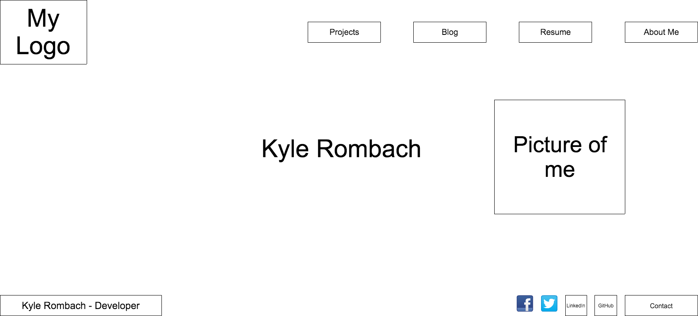
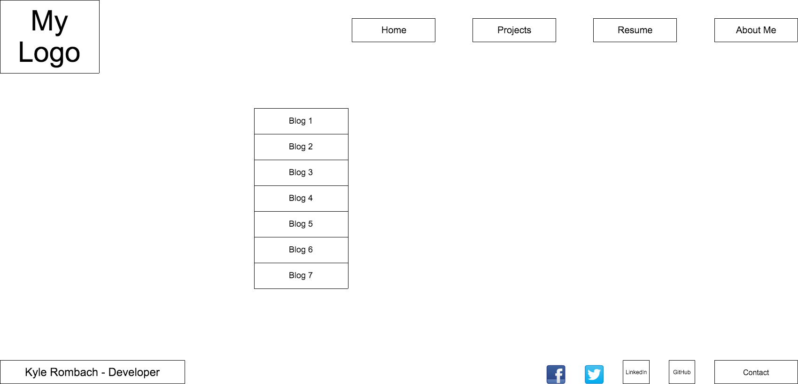

#1. - What is a wireframe?

A wireframe is basically a blueprint for a website. It let's you lay the ground work to see how you want your website to look and be interacted with.

#2. - What are the benefits of wireframing?

Wireframing allows you to see make sure your website will be ideal for what you need. If you have issues understanding your website in it's most basic form, adding
styling would be pointless.You want to make sure everything is sound structurally.

#3. - Did you enjoy wireframing your site?

Yea it was fun getting the basic template out for my site. Using [Cacoo](https://cacoo.com/getstarted/) made it super easy to make my layout. There's still a lot more I could learn though, to make my wireframe even
better.

#4. - Did you revise your wireframe or stick with your first idea?

I ran through a couple ideas of how I wanted to  do my layout before settling on my final design.

#5. - What questions did you ask during this challenge? What resources did you find to help you answer them?

At first I had I struggled a little bit to have an idea of what I wanted my website to look like but using the templates on [Cacoo](https://cacoo.com/getstarted/) and looking around [Google](https://www.google.com/?gws_rd=ssl)
helped with finding some good ideas.

#6. - Which parts of the challenge did you enjoy and which parts did you find tedious?

I thought it was all fun and with [Cacoo](https://cacoo.com/getstarted/) it made it so much easier. Since I liked my index page, I was able to copy the basic layout, and edit it to fit my blog index page needs as well.

