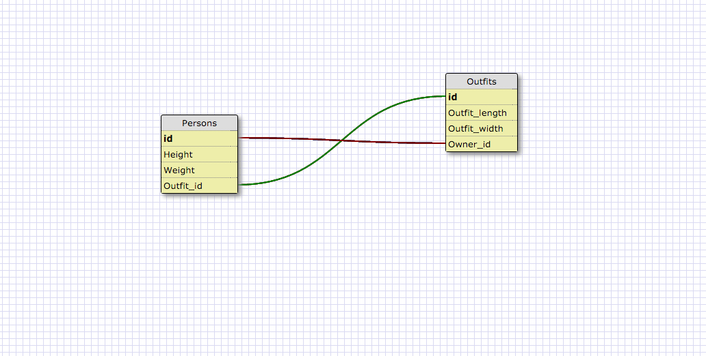

## 1. SELECT * FROM states;

## 2. SELECT * FROM regions;

## 3. SELECT state_name, population FROM states;

## 5. SELECT state_name FROM states WHERE region_id=7;

## 6. SELECT state_name, population_density FROM states WHERE population_density > 50 ORDER BY population_density ASC;

## 7. Select state_name FROM states WHERE population BETWEEN 1000000 AND 1500000;

## 8. SELECT state_name, region_id FROM states ORDER BY region_id ASC;

## 9. SELECT region_name FROM regions WHERE region_name LIKE '%Central%';

## 10. SELECT regions.region_name, states.state_name FROM regions INNER JOIN states ON regions.id=states.region_id;

# Reflection

## What are databases for?

They are for easier storing for large amounts of data. It makes it easier to navigate rather than using an array or hash, which would get long and hard to access.

## What is a one-to-many relationship?

It's how tables and databases relate to each other. You can have someone who owns multiple houses but that doesn't mean the houses have multiple owners.

## What is a primary key? What is a foreign key? How can you determine which is which?

The primary key is the identifier in a database table. There is only one primary key for a table. A foreign key is a key that can link table's together from a primary key.

## How can you select information out of a SQL database? What are some general guidelines for that?

You can access information using the SELECT * FROM which allows you to choose the foreign key and access it from a primary key. You have to always have an ; at the end and the actions must be uppercase.