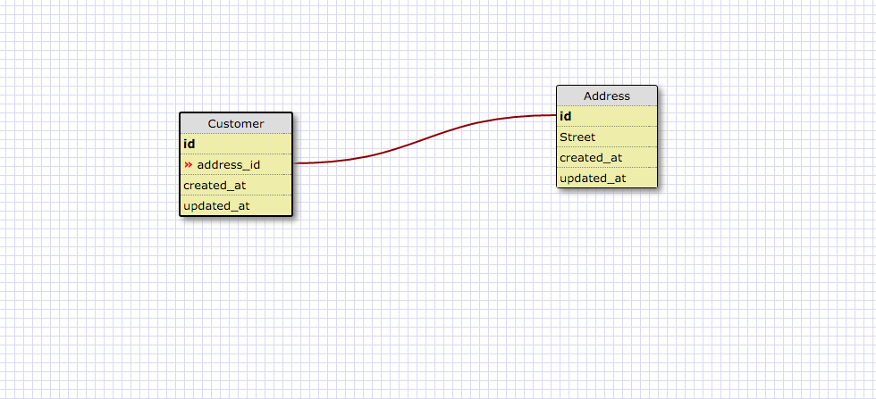
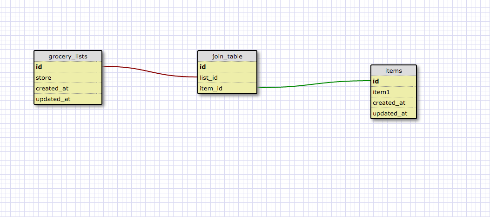

## What is a one-to-one database?

It's a database where both tables have one single relationship between eachother.

## When would you use a one-to-one database? (Think generally, not in terms of the example you created).

When you want to have something only have one item it can be related to. For instance everyone has a social security number so you would want to only have one assigned to each person in your datatbase.

## What is a many-to-many database?

When you have something that is multiple of an item and it can be related to multiple items.

## When would you use a many-to-many database? (Think generally, not in terms of the example you created).

If you have something that has multiple occurences that can have multiple results for each occurence. You can have multiple cars and multiple paint colors. Each one can be assigned to eachother numerous times so that would make it a many-to-many relationship.

## What is confusing about database schemas? What makes sense?

I'm still a little confused on the setup and when to use each database. I understand the connections but not always what they mean.
